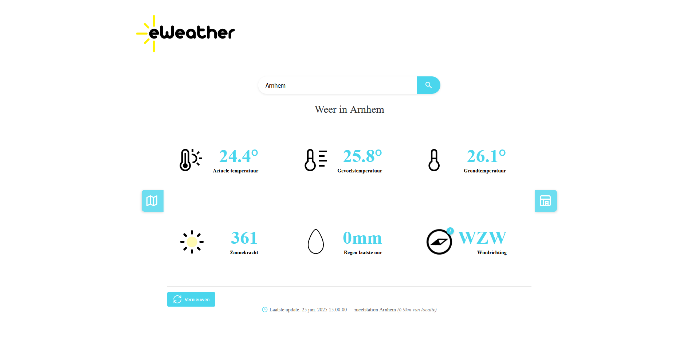

# 🌤️ WeerApp - Dutch Weather Visualization Platform

A full-stack weather application that provides real-time and historical weather data visualization for the Netherlands. Built with Angular frontend, C# .NET backend, and featuring interactive weather maps with multiple data overlays.

 <!-- Add a screenshot when available -->

## Features

### Core Weather Display
- **Real-time Data**: 6 key weather metrics displayed by default
  - Actual Temperature
  - Apparent Temperature  
  - Ground Temperature
  - Solar Irradiation (Insolation)
  - Rainfall (Last Hour)
  - Wind Direction
- **Smart City Search**: Intelligent search suggestions for any Dutch city
- **Default Location**: Displays Arnhem weather data on startup

### Interactive Weather Map
- **Multiple Data Overlays**: Toggle between 5 different weather visualizations
  - 🌡️ Temperature
  - 🌧️ Rainfall
  - 💧 Humidity  
  - ☀️ Solar Power/Insolation
  - 💨 Wind Speed
  - 
- **Advanced Interpolation**: Inverse Distance Weighting (IDW) algorithm for smooth data visualization
- **Station Markers**: View data from individual Buienradar measurement stations
- **User Location**: Your searched location is highlighted with a custom marker
- **Netherlands-Focused**: Map bounds restricted to Netherlands with city labels

### Historical Weather Data
- **Complete History**: Access weather data from the moment you first started the backend
- **Same Metrics**: All 6 core weather data points available historically
- **Data Persistence**: MySQL database stores all collected measurements

### Technical Features
- **Real-time Updates**: Backend polls Buienradar API every 10 minutes (configurable)
- **Responsive Design**: Works seamlessly on desktop and mobile
- **Performance Optimized**: Chunked rendering prevents UI freezing
- **Clean Architecture**: Separation between data collection, API, and frontend

## Architecture

### Data Flow
Buienradar API → Weather Service → MySQL Database → REST API Service → Angular Frontend

### Backend Components
- **WeatherService**: Background service that polls Buienradar API every 10 minutes
- **WeatherService.API**: REST API that serves weather data to frontend
- **Entity Framework**: ORM for MySQL database operations
- **MySQL Database**: Stores historical weather measurements

### Frontend Components
- **Angular 19**: Modern SPA with component-based architecture
- **Leaflet**: Interactive maps with custom overlays
- **Turf.js**: Geospatial analysis for data interpolation
- **TypeScript**: Type-safe development

## Quick Start

### Prerequisites
- [.NET 9.0 SDK](https://dotnet.microsoft.com/download/dotnet/9.0)
- [Node.js 18+](https://nodejs.org/)
- [Angular CLI](https://angular.io/cli)
- [XAMPP](https://www.apachefriends.org/) (for MySQL)

### One-Command Startup
The easiest way to start the entire application stack:

```bash
# Clone the repository
git clone https://github.com/yourusername/weer-app.git
cd weer-app

# Run the automated startup script
start-project.bat
```

## Manual Setup

### 1. Database Setup

```bash
# Start XAMPP
cd C:\xampp
xampp_start.exe apache mysql
```

### 2. Backend Services

```bash
# Terminal 1: Weather Data Collection Service
cd backend/WeatherService
dotnet run

# Terminal 2: REST API Service  
cd backend/WeatherService.API
dotnet run
```

### 3. Frontend

```bash
# Terminal 3: Angular Application
cd frontend
npm install
ng serve
```

### 4. Access the application

- **Main App**: http://localhost:4200
- **API Documentation**: http://localhost:5216/swagger

## Configuration

### Backend Configuration

Edit `appsettings.json`:

```json
{
  "WeatherSettings": {
    "PollingIntervalMinutes": 10,
    "BuienradarApiUrl": "https://data.buienradar.nl/2.0/feed/json"
  },
  "ConnectionStrings": {
    "DefaultConnection": "server=localhost;database=WeatherApp;user=root;password="
  }
}
```

### Map Configuration

Weather map settings can be adjusted in `weather-map.component.ts`:

```typescript
// Map bounds (Netherlands)
const panBounds = L.latLngBounds(
  [50.47, 3.2],   // Southwest
  [53.7, 7.38]    // Northeast  
);

// IDW interpolation settings
const chunkSize = 40;  // Processing chunk size
const canvasSize = 400; // Rendering resolution
```

## Usage

### Basic Weather Viewing

1. **Default View**: App loads with Arnhem weather data
2. **Search Location**: Use the search bar with intelligent city suggestions
3. **View Details**: Each weather metric is clearly displayed with icons

### Interactive Weather Map

1. **Open Map**: Click the map button (slide-out tab on the left)
2. **Switch Data Types**: Use the toggle buttons to view different weather parameters
3. **Explore Stations**: Click on station markers to see individual measurements
4. **Find Your Location**: Your searched city is highlighted with a special marker

### Historical Data

1. **Open History**: Click the history button (slide-out tab on the right)
2. **Browse Timeline**: View weather data from any date since you started collecting
3. **Compare Trends**: Analyze weather patterns over time

## API Endpoints

### Weather Data

```bash
GET /api/nearest                       # Weather data of station nearest to search location
GET /api/stationsWithWeather                      # All latest station data
GET /api/station/{stationName}         # Latest data by station name
GET /api/history/{stationId}           # Historical data for station
get /api/locations                     # All valid locations (for search suggestions)
```

### Station Management

```bash
GET /api/stations                      # All weather stations (with coordinates)
```

### Example Response

```json
{
  "locationName": "Arnhem",
  "locationLatitude": 52.0099492,
  "locationLongitude": 5.9066406,
  "id": 5174,
  "stationId": 6275,
  "stationName": "Meetstation Arnhem",
  "lat": 52.07,
  "lon": 5.88,
  "regio": "Arnhem",
  "weatherDescription": "Mix van opklaringen en middelbare of lage bewolking",
  "airPressure": 1013.2,
  "windDirection": "W",
  "windDirectionDegrees": 262,
  "temperature": 24.9,
  "groundTemperature": 26.9,
  "feelTemperature": 26.1,
  "humidity": 50,
  "windSpeed": 4.7,
  "windSpeedBft": 3,
  "rainfallLastHour": 0,
  "sunPower": 532,
  "timestamp": "2025-06-25T15:40:00",
  "lastUpdated": "2025-06-25T16:05:00"
}
```

## Development

### Project Structure

```bash
weer-app/
├── backend/
│   ├── WeatherService/           # Background data collection
│   ├── WeatherService.API/       # REST API
│   └── WeatherService.Shared/    # Shared models
├── frontend/
│   ├── src/app/
│   │   ├── components/           # Angular components
│   │   ├── services/            # API services
│   │   └── models/              # TypeScript models
│   └── ...
├── docs/                        # Documentation
└── start-project.bat           # Automated startup script
```

### Adding New Weather Data Types
1. **Update Enum** in weather-map.component.ts:

```typescript
export enum WeatherDataType {
  Temperature = 'temperature',
  Rainfall = 'rainfallLastHour',
  // Add new type here
  Pressure = 'pressure'
}
```

2. **Add Color Gradient** in getDataColor() method
3. **Update Legend** in addDataLegend() method
4. **Add Switch Case** in renderDataMap() method

### Performance Considerations
- **Chunked Rendering**: Map rendering is split into chunks to prevent UI freezing
- **Optimized IDW**: Uses efficient distance calculations without square roots
- **Canvas Size**: Configurable resolution (400x400 default) balances quality vs performance

## Troubleshooting

### Common Issues

#### **Backend won't start**:
- Ensure XAMPP MySQL is running
- Check if ports 4200/5216 are available
- Verify .NET 9.0 is installed

#### **Frontend compilation errors:
- Run npm install in the frontend directory
- Check Node.js version (18+ required)
- Clear Angular cache: ng cache clean

#### **Map not loading**:

- Check browser console for JavaScript errors
- Ensure Leaflet CSS is loading
- Verify API is returning station data
  
#### **No weather data**:

- Backend needs time to collect initial data (10+ minutes)
- Check Buienradar API accessibility
- Verify database connection
  
## License
This project was created as part of a software engineering traineeship and is intended for educational and personal use.

## Contributing
Since this is a traineeship project, contributions are not currently being accepted. However, feel free to fork the project for your own learning purposes!

## Support
For questions about this project, please refer to the code comments and documentation. This project serves as a learning exercise and demonstration of full-stack development capabilities.

--- 

Built with ❤️ during my software engineering traineeship